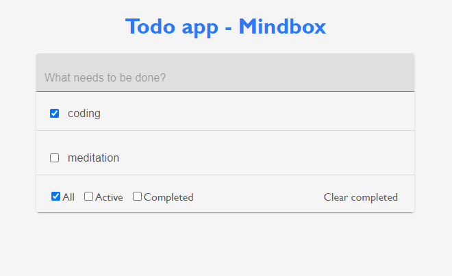

# TodoList with React, Redux and TypeScript

## Features:
* Create a new item
* Toggle item
* Delete completed item 
* Filter items (show all, active and completed)

## Getting Started

### Dependencies:
Tools needed to run this app: `node` and `npm`

### Installing:
* `npm install` to install dependencies

### Running the App:
After you have installed all dependencies, you may run the app.

- `npm start`
- Go to `http://localhost:3000`
